# Azure Data Factory (ADF) Pipelines

This project uses Azure Data Factory (ADF) to orchestrate end-to-end data ingestion workflows for a scalable **ETL pipeline for chatbot and booking data**.

---

## Overview

ADF acts as the **orchestration layer**, responsible for:

* Ingesting data from **Azure SQL Database (chatbot + booking data)**
* Managing **incremental data loads using watermark logic**
* Moving data into **Azure Data Lake Storage Gen2 (Bronze layer)**
* Enabling **modular and reusable pipelines**

---

## Pipeline Design

The pipelines are built using a **parameter-driven and modular approach**, ensuring:

* Reusability across multiple datasets
* Scalability for additional sources
* No hardcoded logic
* Easy maintenance and extension

---

## Key Components

---

### 1. Linked Services

Connections established between ADF and external systems:

* Azure SQL Database (Source)
* Azure Data Lake Storage Gen2 (Sink)

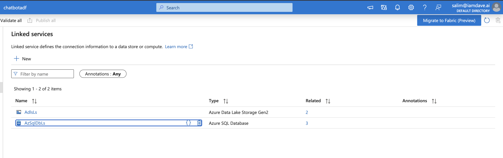

---

### 2. Datasets

Datasets define the structure of input and output data.

#### SQL Dataset (Source)

* Represents chatbot and booking tables
* Used for incremental extraction

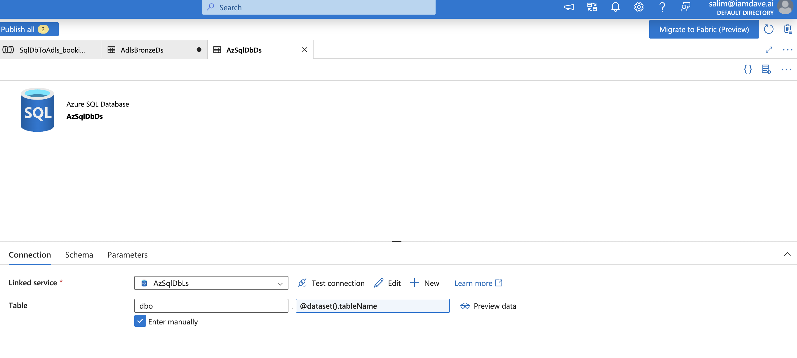

---

#### ADLS Dataset (Sink)

* Stores data in **Parquet format**
* Supports dynamic paths for incremental loads

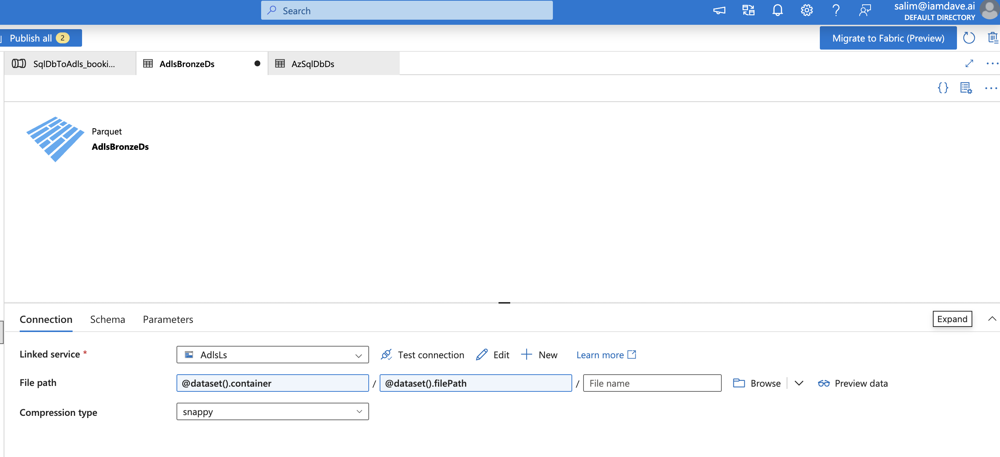

---

## Pipelines

---

### 3. Booking Data Pipeline

Pipeline: `sql_db_to_adls_booking_pipe`

Handles incremental ingestion of booking data from SQL DB to ADLS.

**Activities:**

* Lookup → Fetch last watermark
  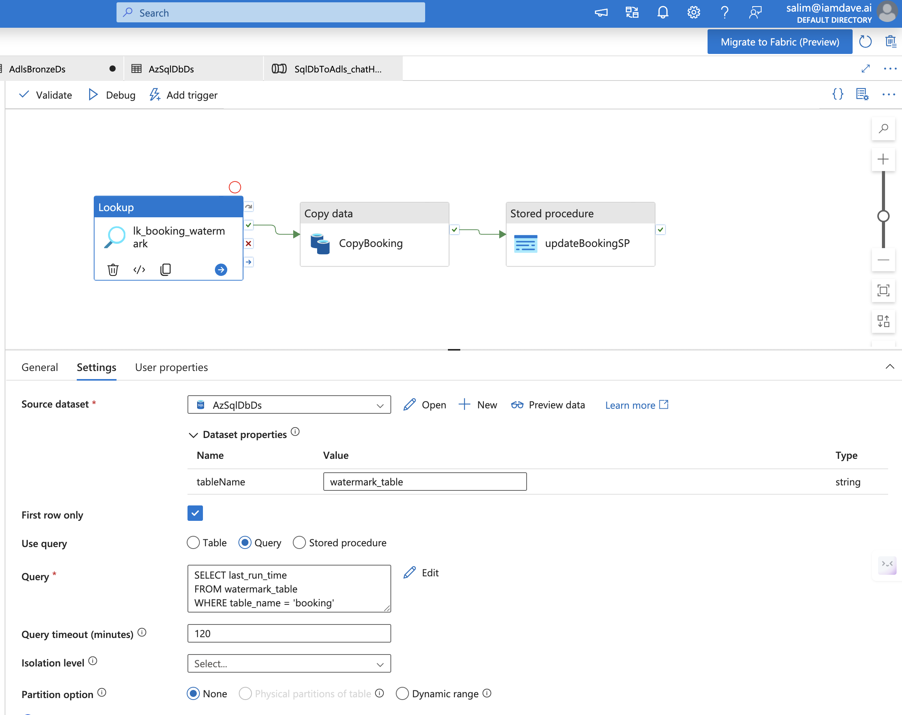

* Copy (Source → Sink) → Load incremental data
  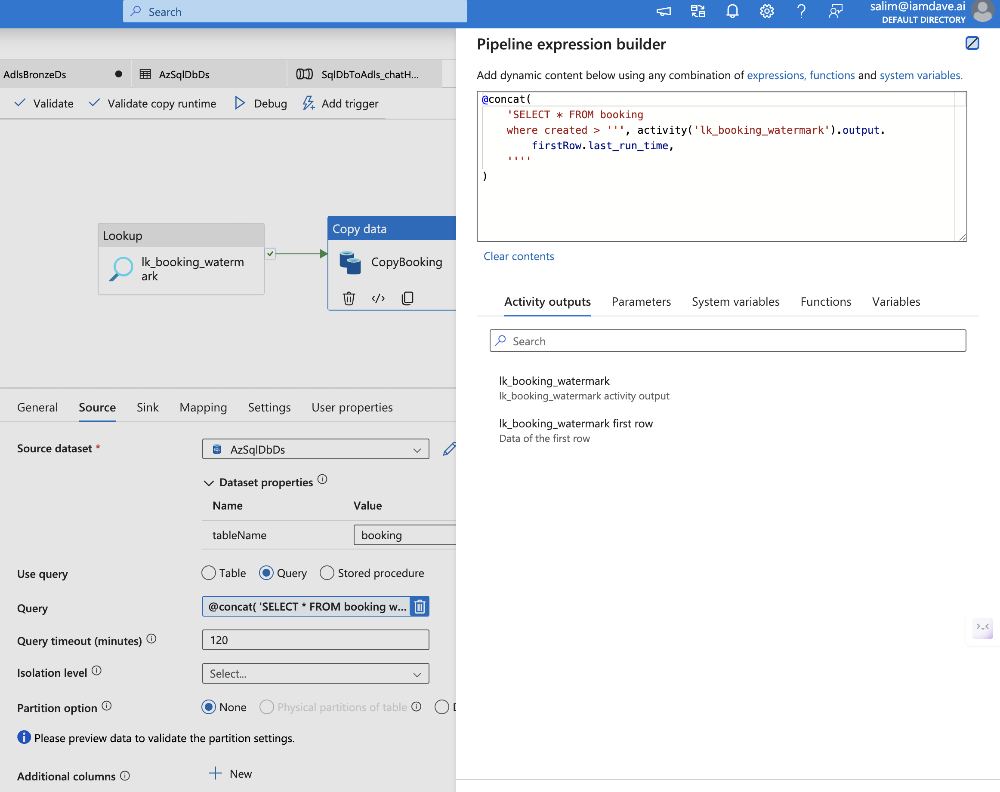
  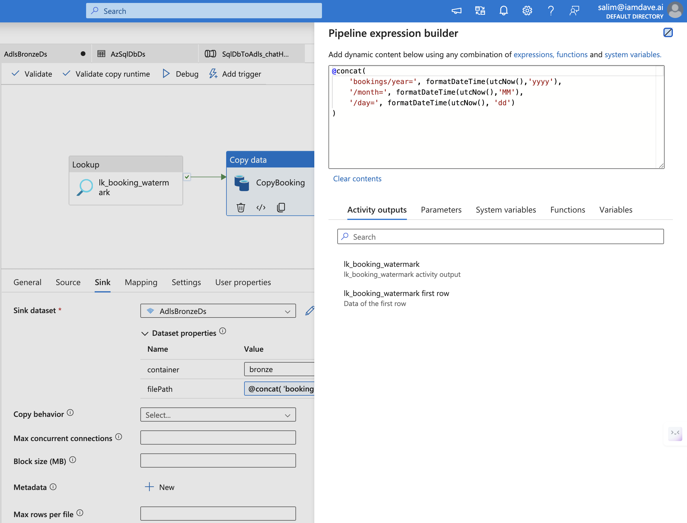

* Stored Procedure → Update watermark
  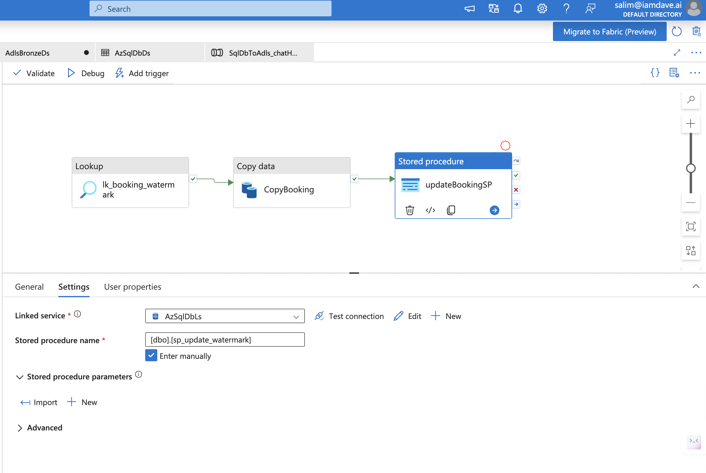

 Pipeline Overview:
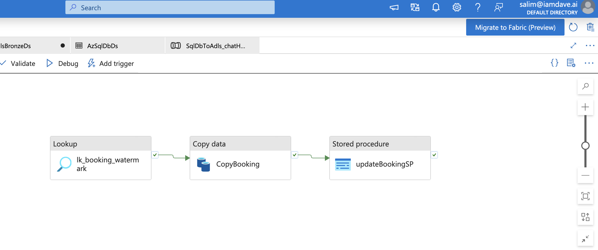

---

### 4. Chat History Pipeline

Pipeline: `sql_db_to_adls_chatHistory_pipe`

Handles ingestion of chatbot interaction data.

**Activities:**

* Lookup → Fetch watermark
  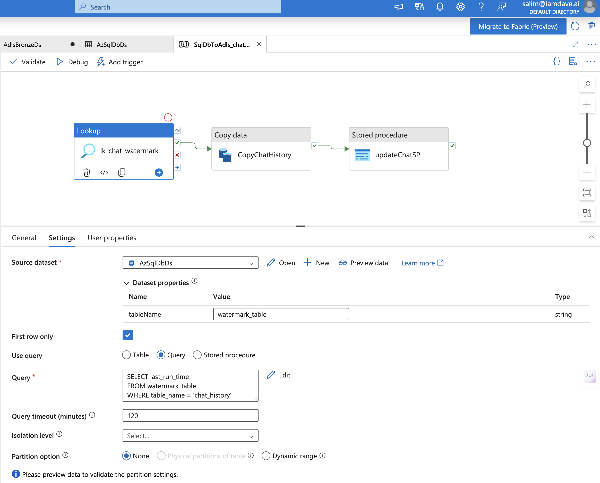

* Copy (Source → Sink)
  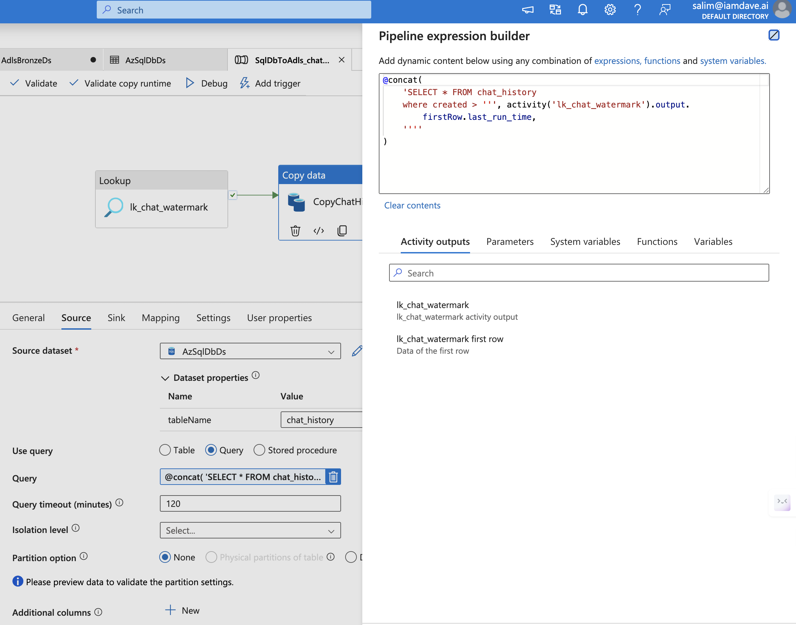
  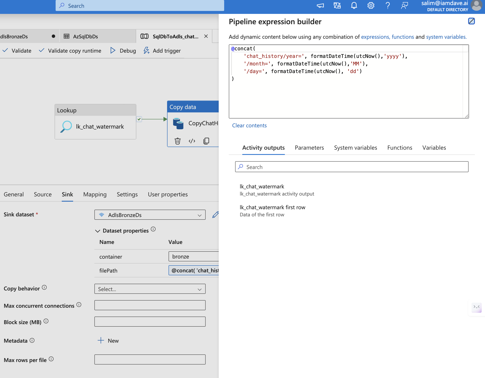

* Stored Procedure → Update watermark
  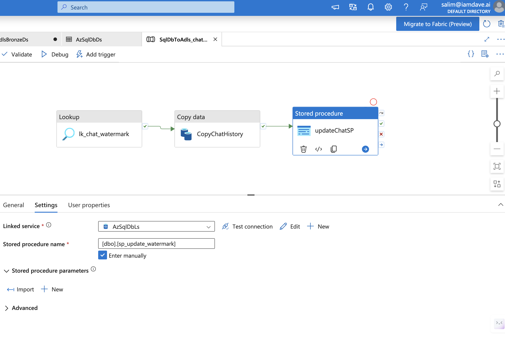

 Pipeline Overview:
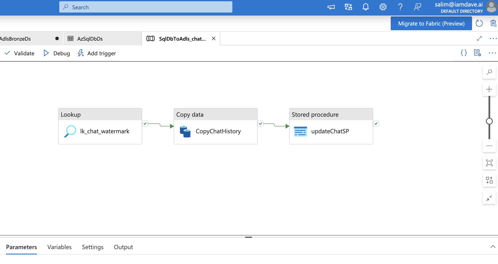

---

### 5. Orchestration Pipeline

Pipeline: `execute_book_and_chatHist_pipe`

* Executes both booking and chat pipelines
* Ensures controlled execution flow

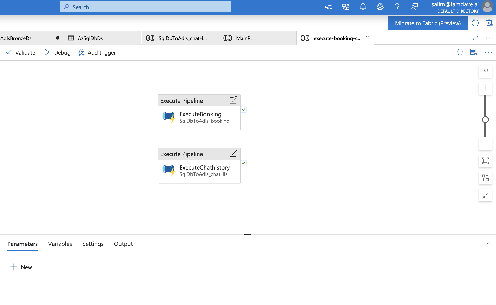

---

### 6. Main Pipeline

Pipeline: `main_pipe_starting`

* Entry point of execution
* Can be triggered manually or scheduled

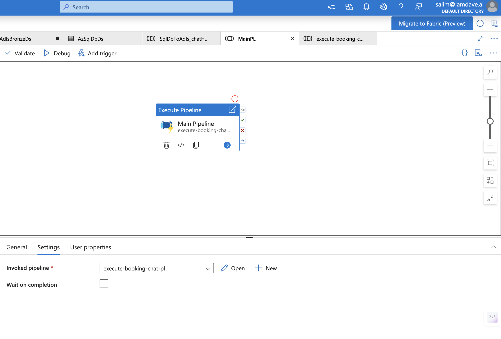

---

## Incremental Load Strategy

* Uses **watermark (max created timestamp)**
* Lookup retrieves last processed value
* Copy activity loads only new records
* Stored procedure updates watermark

✔ Ensures efficient and scalable ingestion
✔ Prevents duplicate processing

---

## Data Quality Handling

* Dropping records with null critical fields (e.g., timestamps)
* Quarantining invalid booking records (missing booking_id)
* Schema drift enabled for flexible ingestion

---

## Output

* Data is stored in **ADLS Gen2 (Bronze layer)**
* Format: **Parquet (optimized for performance)**
* Acts as **raw source for downstream Databricks processing**

---

## Summary

ADF serves as a **robust ingestion and orchestration layer**, enabling:

* Scalable data movement
* Incremental processing
* Reliable pipeline execution

This forms the foundation for further transformation in **Databricks (Silver & Gold layers)**.

---
