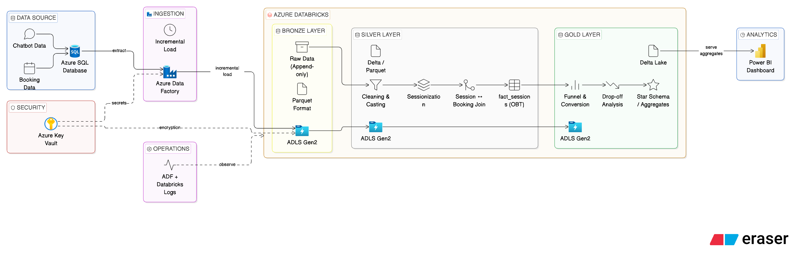

# Project Documentation

This section contains the **high-level architecture and design documentation** for the chatbot data pipeline.

---

## Overview

The project is built using a **modern data engineering architecture on Azure**, following the **Medallion Architecture (Bronze → Silver → Gold)**.

It is designed to process chatbot interaction data and booking data to generate **business insights such as funnel analysis, conversion rates, and user behavior tracking**.

---

## Architecture Diagram

The diagram below represents the **end-to-end data flow across all layers**, including ingestion, processing, storage, and serving.

---

## Architecture Summary

The pipeline is structured into the following layers:

---

### Data Source Layer

* Azure SQL Database
* Stores chatbot interaction data and booking data

---

### Ingestion Layer

* Azure Data Factory (ADF)
* Performs **incremental data ingestion using watermark logic**
* Loads data into ADLS Gen2

---

### Storage Layer (Data Lake)

* Azure Data Lake Storage Gen2
* Organized using Medallion Architecture:

#### Bronze Layer

* Raw data stored in Parquet format
* Append-only, no transformations
* Acts as source of truth

---

#### Silver Layer

* Data cleaning and transformation
* Sessionization using PySpark window functions
* Time-based join between chatbot sessions and bookings
* Data quality checks and standardization

---

#### Gold Layer

* Business-level aggregations
* Funnel analysis (engagement → conversion)
* Drop-off analysis
* City and product performance

---

### Processing Layer

* Azure Databricks (PySpark)
* Handles large-scale distributed data processing
* Implements transformation logic and data modeling

---

### Serving Layer

* Power BI / Analytics tools
* Used for dashboards and reporting

---

### Additional Components

#### Orchestration

* ADF pipelines and triggers
* Databricks jobs

#### Data Quality

* Null handling
* Quarantine for invalid records
* Schema drift handling

#### Security

* Azure Key Vault
* Access control and permissions

---

## Key Highlights

* End-to-end ETL pipeline using Azure ecosystem
* Incremental ingestion for efficiency and scalability
* Session-based analytics using distributed processing
* Accurate booking attribution using time-based joins
* Delta Lake for reliability (ACID, versioning)
* Business-ready datasets for analytics and reporting

---

## Summary

This architecture enables **scalable, reliable, and production-ready data processing**, transforming raw chatbot data into actionable business insights.

---
